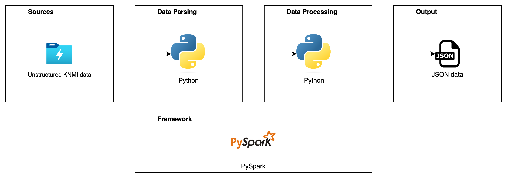

## Architecture

The Heatwave Analysis Tool follows a modular architecture, consisting of the following components:

1. **Data Acquisition**: This component is responsible for fetching weather data from external blob storage. It includes functionality to download and extract data files.

2. **Spark Integration**: Apache Spark is used for parallel processing of large datasets. The Spark integration component manages the Spark session and distributes data processing tasks across multiple workers.

3. **Data Parsing**: The data parsing component handles the parsing of the data (.txt files) and creates a tabular dataset.

4. **Data Processing**: The data processing component handles the transformation and analysis of weather data. It includes functions for parsing, filtering, and aggregating data to identify heatwaves.

5. **Output Generation**: Once heatwaves are identified, the output generation component formats the results and produces a report in JSON format.

6. **Configuration Management**: Environment variables are used to configure various parameters such as the location, temperature thresholds, and duration criteria for identifying heatwaves.

### Overview

